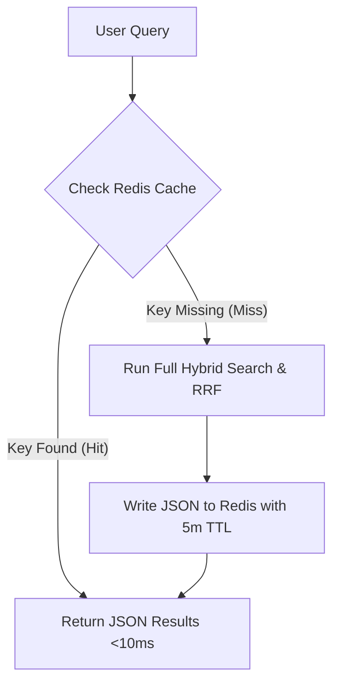

# Caching & Performance

High throughput and low latency are achieved using an asynchronous caching system backed by Redis. This layer sits in front of the database and search engines, preventing system degradation under load.

---

## 1. Async Redis Cache Client

The cache infrastructure is implemented in [`RedisClient`](file:///home/mium/code/mercury/app/infrastructure/cache/redis.py) using `redis.asyncio` with connection pools.

### Pool Settings
* **Max Connections:** Configured to `20` concurrent active socket connections.
* **Auto-decoding:** `decode_responses=True` is enabled, returning Python string types instead of raw bytes.
* **Connection Resilience:** If Redis is down at startup, connection failure is caught gracefully, allowing the FastAPI server to start and operate in fallback mode (direct DB access).

---

## 2. Search Cache Layer

The search orchestrator uses the cache to serve repeated queries without invoking the embedding generator or indexing servers.



### Cache Key Formulation
Cache keys are unique and deterministic. They combine the query string, user details, and active search filters:
```python
cache_key = f"search:{query}:{user_id}:{filters}"
```
For tenant-scoped queries, the organization ID is prefixed to prevent data leakage across clients:
```python
cache_key = f"tenant_search:{tenant_context.organization_id}:{query}:{user_id}:{filters}"
```

### Time-to-Live (TTL)
* **Search Results:** Cached for **5 minutes (300 seconds)**. This balances freshness (catalog edits appear quickly) and database protection (repeated queries are served from memory).
* **Conversations:** Messages and context are cached with a **1 hour (3600 seconds)** TTL.
* **User Context:** User profiles and preferences are cached with a **30 minute (1800 seconds)** TTL.

---

## 3. Performance Metrics & Stats

The orchestrator updates cache health and performance counters in real-time, exporting them via the Prometheus `/metrics` endpoint:
* **`mercury_cache_hits_total` (Counter):** Incremented every time a search query is resolved via Redis.
* **`mercury_cache_misses_total` (Counter):** Incremented when queries must hit the databases.
* **`mercury_cache_hit_rate` (Gauge):** Expressed as a value between `0.0` and `1.0`. Calculated on every query: $\text{Hits} / \text{Total Queries}$. Typical performance in normal production is **~70% hit rate**.

The [`get_cache_stats()`](file:///home/mium/code/mercury/app/infrastructure/cache/redis.py#L399) method also extracts:
* `total_keys`: Active keys stored in database `db0`.
* `memory_usage`: Human-readable memory foot-print (e.g., `used_memory_human`).
* `connected_clients`: Active client connections.
* `uptime`: Total Redis server uptime in seconds.
