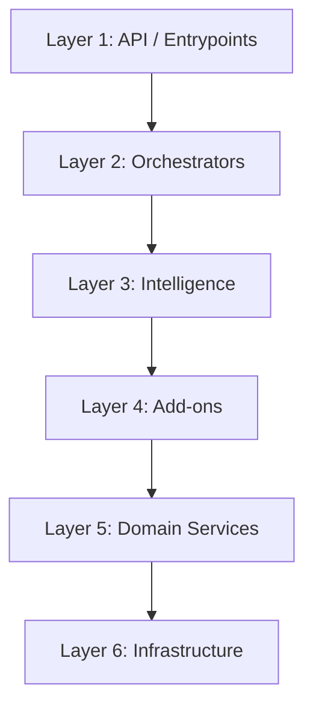

# System Architecture

The Mercury platform is built using a strict, modular **Clean Architecture** style. The system enforces a clear separation of concerns, ensuring that business logic remains decoupled from frameworks, databases, and external APIs.

---

## Architectural Layers

### Layer 1: API / Entrypoints
* **Directory:** [`app/api/`](file:///home/mium/code/mercury/app/api)
* **Purpose:** Handles external HTTP requests, routing, parameter validation, and WebSockets.
* **Key Components:**
  * [`app/api/v1/endpoints/search.py`](file:///home/mium/code/mercury/app/api/v1/endpoints/search.py): Search routes.
  * [`app/api/v1/endpoints/chat.py`](file:///home/mium/code/mercury/app/api/v1/endpoints/chat.py): Chat endpoints.
  * [`app/websocket/handlers.py`](file:///home/mium/code/mercury/app/websocket/handlers.py): Async WebSocket connection and message loops.

### Layer 2: Orchestrators
* **Directory:** [`app/orchestrators/`](file:///home/mium/code/mercury/app/orchestrators)
* **Purpose:** Coordinates workflows across services, manages transactional borders, aggregates data, and records Prometheus execution metrics.
* **Key Components:**
  * [`SearchOrchestrator`](file:///home/mium/code/mercury/app/orchestrators/search_orchestrator.py): Coordinates synonym expansion, search queries, merchandising (pinned products), personalization scoring, out-of-stock demotions, and caching.
  * [`ChatOrchestrator`](file:///home/mium/code/mercury/app/orchestrators/chat_orchestrator.py): Runs conversational logic, chat memory retention, and tool calling loops.

### Layer 3: Intelligence
* **Directory:** [`app/intelligence/`](file:///home/mium/code/mercury/app/intelligence)
* **Purpose:** Integrates LLM clients (Google Gemini 2.5) and defines functional tools for assistant capabilities.
* **Key Components:**
  * [`LLMEngine`](file:///home/mium/code/mercury/app/intelligence/engine.py): Manages Gemini API sessions, falls back to a mock mode when keys are missing, and exposes vision capabilities.
  * **Tools:** `SearchTools`, `VariantTools`, `PersonalizationTools`, `ProductTools`, and `UserTools` expose functional APIs to the Gemini function calling engine.
  * [`CapabilityChain`](file:///home/mium/code/mercury/app/intelligence/workflow/capability_chain.py): Formulates structured logical plans for multi-step assistant queries.

### Layer 4: Add-ons
* **Directory:** [`app/addons/`](file:///home/mium/code/mercury/app/addons)
* **Purpose:** Contains search algorithms, embedding generation, short-term session memory, personalization scorers, and image processors.
* **Key Components:**
  * [`HybridSearch`](file:///home/mium/code/mercury/app/addons/search/hybrid.py): Merges semantic and keyword indices.
  * [`LocalEmbedder`](file:///home/mium/code/mercury/app/addons/embeddings/local_embedder.py): Runs sentence-transformers model locally for embedding generation.
  * [`PersonalizationScorer`](file:///home/mium/code/mercury/app/addons/personalization/scorer.py): Calculates category, brand, and rating boosts per user preferences.

### Layer 5: Domain Services
* **Directory:** [`app/domain/`](file:///home/mium/code/mercury/app/domain)
* **Purpose:** Core business rules and data services.
* **Key Components:**
  * [`ProductService`](file:///home/mium/code/mercury/app/domain/products/service.py): Manages catalog operations.
  * [`UserService`](file:///home/mium/code/mercury/app/domain/users/service.py): Manages profiles and preferences.
  * [`TenantService`](file:///home/mium/code/mercury/app/domain/tenants/service.py): Manages multi-tenant configurations.

### Layer 6: Infrastructure
* **Directory:** [`app/infrastructure/`](file:///home/mium/code/mercury/app/infrastructure)
* **Purpose:** Handles external connections and database-specific query logic. Exposes clean interfaces to higher layers.
* **Key Components:**
  * [`PostgresClient`](file:///home/mium/code/mercury/app/infrastructure/db/postgres.py): Async PostgreSQL access using SQLAlchemy connection pooling.
  * [`RedisClient`](file:///home/mium/code/mercury/app/infrastructure/cache/redis.py): Async Redis client with connection pooling.
  * [`TypesenseClient`](file:///home/mium/code/mercury/app/infrastructure/search/typesense.py): Low-level search server client.

---

## Dependency Injection (DI)

Service construction and lifecycle management are centralized in [`app/container.py`](file:///home/mium/code/mercury/app/container.py). The `Container` class acts as the registry for all services and is wired up at application startup.

### Lifecycle Flow
1. **Infrastructure Initialization:** Connects to PostgreSQL, Redis, and Typesense with connection pools. Sets up local disk storage or MinIO.
2. **Domain Service Instantiation:** Creates user, product, suggestion, and tenant services, injecting database and cache dependencies.
3. **Add-ons Instantiation:** Initializes the local embedding model, hybrid search wrapper, personalization scorer, and image processor.
4. **Intelligence Layer Setup:** Connects the LLM Engine to Gemini API.
5. **Orchestrator Injection:** Creates orchestrated classes and hooks up Gemini function calling tools.
