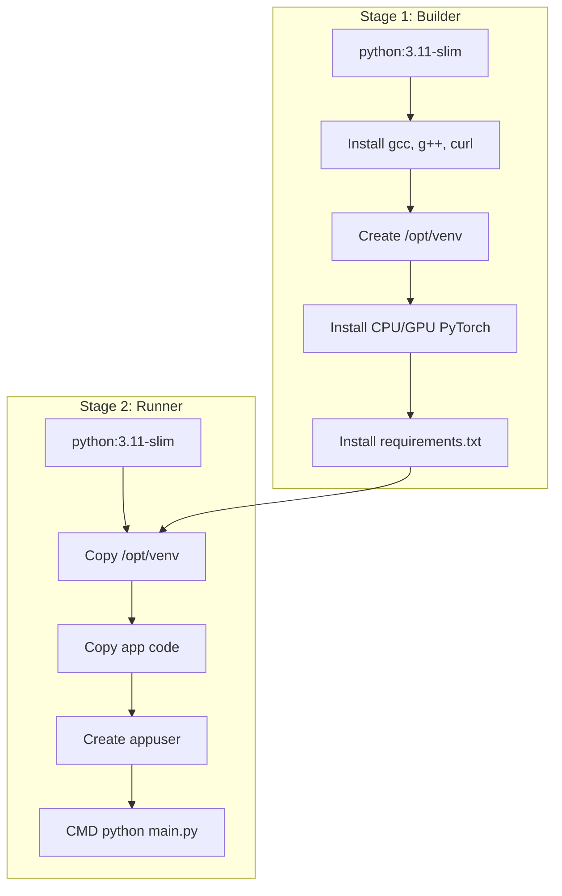

# Infrastructure & Deployment

The deployment pipeline is built around optimized, secure, and resource-efficient container configurations. The system is designed to run in both light-weight CPU environments (local/dev) and high-performance GPU cluster environments (production).

---

## 1. Multi-Stage Dockerfile Optimization

The [`Dockerfile`](file:///home/mium/code/mercury/Dockerfile) is structured as a two-stage build to isolate compilation tools and minimize the final runtime image footprint.



### Decoupling CUDA binaries (Saving 2.3 GB)
By default, running `pip install torch` downloads NVIDIA CUDA binaries, bloating the image to over 2.8 GB. To prevent this, the build system leverages a custom build argument:

```dockerfile
ARG USE_GPU=false

RUN if [ "$USE_GPU" = "true" ] ; then \
        pip install --no-cache-dir torch>=2.0.0 sentence-transformers>=2.2.0 ; \
    else \
        pip install --no-cache-dir torch>=2.0.0 --index-url https://download.pytorch.org/whl/cpu && \
        pip install --no-cache-dir sentence-transformers>=2.2.0 ; \
    fi
```

To prevent standard pip commands from overriding the CPU wheel, development packages and torch/sentence-transformers are stripped from `requirements.txt` before final installation:
```dockerfile
RUN grep -v -E '^(torch|sentence-transformers)' requirements.txt > req_filtered.txt && \
    pip install --no-cache-dir -r req_filtered.txt && \
    rm req_filtered.txt
```

### Security Hardiness
The runner container implements security best practices:
* **Non-Root Execution:** Runs under `appuser` (created via `adduser --disabled-password --gecos '' appuser`).
* **Minimal Packages:** The compiler tools (`gcc`, `g++`) are discarded in Stage 1, leaving only `curl` (needed for container health checks) in Stage 2.
* **Docker Healthcheck:** Exposes an integrated health probe testing `/health` with a 30s interval:
  ```dockerfile
  HEALTHCHECK --interval=30s --timeout=30s --start-period=5s --retries=3 \
      CMD curl -f http://localhost:8000/health || exit 1
  ```

---

## 2. Multi-Container Orchestration

The full application stack is orchestrated via [`docker-compose.yml`](file:///home/mium/code/mercury/docker-compose.yml), declaring six interdependent services:

1. **`app`:** The FastAPI application running behind Gunicorn/Uvicorn.
2. **`postgres`:** Database storage, mounting local volumes for persistence.
3. **`redis`:** In-memory caching database.
4. **`typesense`:** Indexed keyword/hybrid search engine.
5. **`prometheus`:** System metrics scraper.
6. **`grafana`:** Visual observability dashboard.

---

## 3. Lifecycle Scripts

### Database Migrations (`start.sh`)
The container startup is governed by [`start.sh`](file:///home/mium/code/mercury/start.sh). This script:
1. Waits for PostgreSQL to accept socket connections.
2. Runs database migration plans using Alembic:
   ```bash
   alembic upgrade head
   ```
3. Checks if mock data needs to be populated.
4. Starts the application process.

### Search Schema Setup & Indexing
To seed and provision the search engine index:
* **`scripts/setup_typesense.sh`:** Asserts connection to Typesense port `8108` and configures default settings.
* **`scripts/index_typesense.py`:** Reads product models from Postgres, constructs flat documents with vectors, and imports them in batches.
