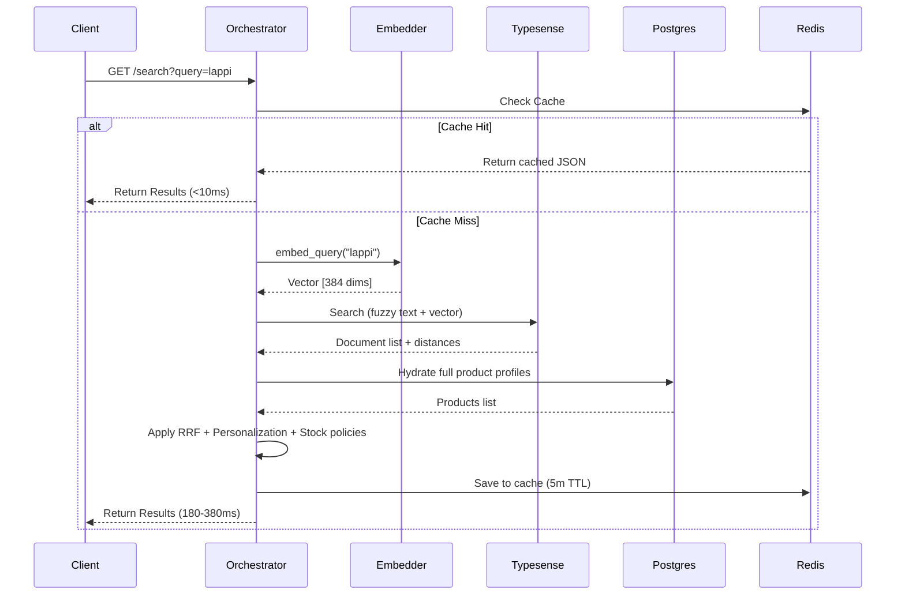

# Advanced Search Engine

The search system is a core feature of the Mercury platform, providing hybrid search (fuzzy keyword + semantic vector) with personalized ranking, catalog syncing, and strict variant matching.

---

## 1. Hybrid Search Architecture

The platform combines fuzzy text matching and dense vector embeddings into a single search workflow:
* **Fuzzy Text Match:** Handles typo tolerance, prefix matching, and word stem matching (powered by Typesense's fuzzy matching parameters `num_typos=2` and `prefix=True`).
* **Semantic Vector Search:** Maps search queries to product concepts (e.g., matching "warm jacket" with "fleece insulated coat"). Uses a local sentence-transformers model.

### Embedding Generation
The system uses [`LocalEmbedder`](file:///home/mium/code/mercury/app/addons/embeddings/local_embedder.py) initialized with the **`all-MiniLM-L6-v2`** model:
* Generates dense float vectors of **384 dimensions**.
* Operates locally on CPU (standard fallback) or GPU (if `USE_GPU=true` build flag is specified in Docker).
* Prepares product documents by concatenating text fields (`title`, `name`, `description`, `brand`, `category`, `sub_category`) and tags into a single text block for indexing.

---

## 2. Reciprocal Rank Fusion (RRF) & Reranking

When combining results or scoring across indices, the [`ReciprocalRankFusion`](file:///home/mium/code/mercury/app/addons/search/rrf.py) class fuses candidates based on the standard RRF formula:

$$RRF\_Score(d) = \sum_{i \in \text{sources}} \frac{\text{weight}_i}{k + \text{rank}_i(d)}$$

* **Constant ($k$):** Set to `60` (standard RRF constant to prevent high-ranking items from completely dominating).
* **Weights:** Default keyword engine weight is `0.6` and the fallback/secondary engine weight is `0.4`.

### Dynamic Personalized Boosting
After fusing rank positions, the engine adjusts product scores based on user-specific behaviors and preferences:
* **Category Boost:** $+20\%$ multiplier for products matching the user's favorite category.
* **Brand Boost:** $+15\%$ multiplier for preferred brands.
* **Price Match Boost:** $+10\%$ multiplier if the product falls within the user's preferred budget range.
* **High Rating Boost:** Up to $+30\%$ boost for products rated $>4.0$ (scaled linearly as $\text{rating} / 5.0$).
* **Stock Availability Boost:** $+10\%$ boost for in-stock products.

---

## 3. Strict Variant Discovery

When displaying a product page, the system must distinguish between **variants** (the same product differing only in size/color) and **substitutes** (alternative products serving the same purpose). 

### Tag Priority Order
The system defines a strict tag priority hierarchy:
1. **Brand** (1 - Non-negotiable)
2. **Product Line** (2 - Non-negotiable)
3. **SKU Family** (3 - Non-negotiable)
4. **Product Type** (4)
5. **Category Leaf** (5)
6. **Fabric/Material** (6 - Conditional, required for apparel)
7. **Pattern/Style** (7 - Lowest priority)
8. **Size** (8 - Variant dimension)
9. **Color** (8 - Variant dimension)

### Selection Rules
* **Strict Variants:** All tags from priority `1` through `7` must match exactly between the original product and candidate. Only `Size` and `Color` are allowed to differ.
* **Substitutes:** Used only when user-triggered (e.g., original is out of stock). Substitutes search broader category/sub-category criteria and rank options based on:
  * *Price-focused:* Finding cheaper items (recalculates savings).
  * *Availability-focused:* Prioritizing in-stock items.
  * *Quality-focused:* Prioritizing products with higher ratings.

---

## 4. Real-time Database Synchronization

To ensure search results are up to date with core database changes, the system hooks SQLAlchemy events to a sync pipeline:

1. **ORM Triggers:** Insert or update operations on SQL tables trigger listener hooks ([`triggers.py`](file:///home/mium/code/mercury/app/infrastructure/sync/triggers.py)).
2. **Async Sync Task:** The system extracts the database object, compiles a unified text description of the product, and invokes [`SyncPipeline.sync_product()`](file:///home/mium/code/mercury/app/infrastructure/sync/pipeline.py#L98).
3. **Index Upsert:** The text is embedded via `LocalEmbedder` and upserted directly into the Typesense collection with the vector.
